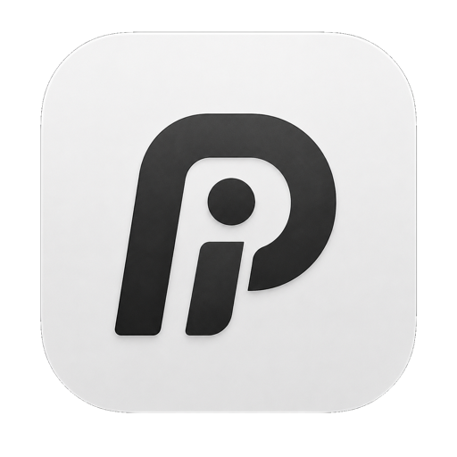
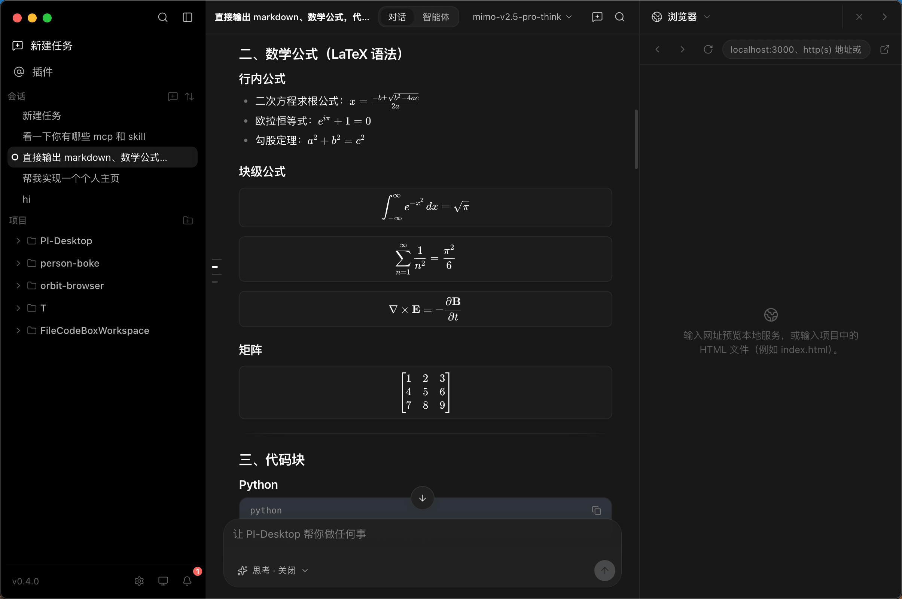
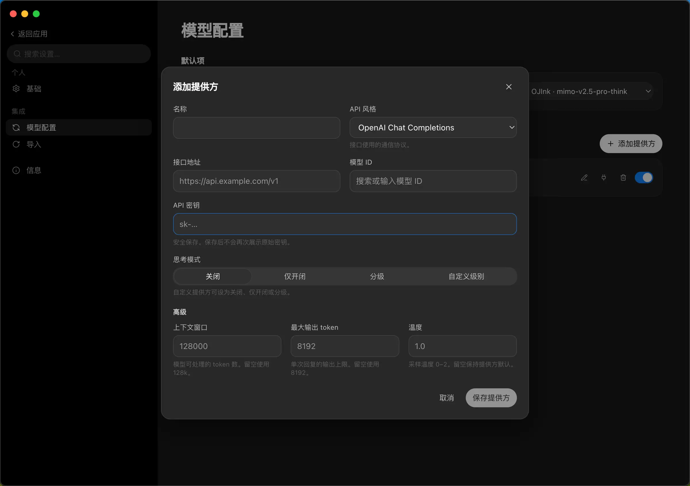
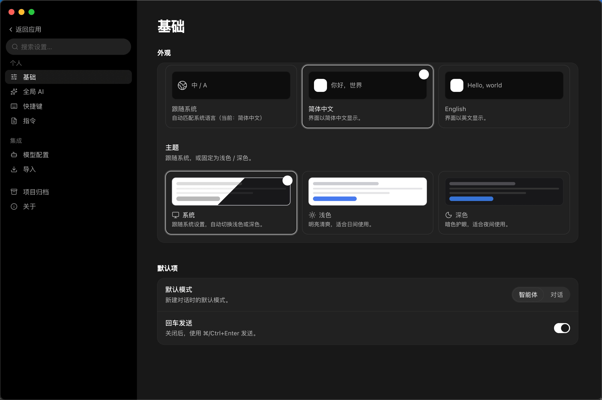

<div align="center">



# PI-Desktop

**A local-first desktop app for AI coding agents.**

Bring your own models. Keep your code, your keys, and your conversations on your machine.

[](https://github.com/vastsa/PI-Desktop/releases/latest)
[](https://github.com/vastsa/PI-Desktop/actions/workflows/ci.yml)


[Download](#download) · [Getting started](#getting-started) · [Highlights](#highlights) · [How it works](#how-it-works) · [Development](#development) · [简体中文](README.zh-CN.md)

<br/>



</div>

## What is PI-Desktop?

PI-Desktop puts an AI coding agent in a native desktop app. Point it at a project, describe what you want — explore and understand code, build a feature, review changes, fix a failing test — and watch it work, with every file edit and shell command surfaced for your approval.

There is no account, no subscription, and no cloud in the middle: you connect the model provider you already use, and everything else — sessions, settings, API keys — stays local.

## Highlights

- **Any model, your keys.** Anthropic, OpenAI, or anything that speaks an OpenAI-compatible API — hosted relays as well as local gateways like Ollama or LM Studio. Model IDs are free-form (no hardcoded allowlist), with per-model context window, output limit, temperature, and thinking-mode controls.
- **You approve every change.** File writes and shell commands ask first, with session-scoped grants and a configurable default policy. Unanswered prompts deny by default.
- **A real workbench.** Review the agent's edits as diffs, open a terminal, preview in a browser, and browse project files — all in a side panel, without leaving the conversation.
- **Projects and sessions.** Sessions are grouped by project in a multi-project sidebar, with pinning, archiving, sorting, and throwaway scratch sessions.
- **Local-first and private.** Transcripts live on disk as plain JSONL with a SQLite index — easy to back up, grep, or delete. API keys go into the OS keychain. Logs stay local; there is no telemetry.
- **Extensible with plugins.** Install `.piplug` packages (or load a folder in dev mode) to add commands, panels, agent tools, and skills. Plugins run out-of-process and are default-deny.
- **Comfortable to live in.** English and 简体中文, light/dark/system themes, command palette, onboarding checklist, and update notifications for packaged builds.

<table>
  <tr>
    <td width="50%"></td>
    <td width="50%"></td>
  </tr>
  <tr>
    <td align="center"><sub>Bring your own provider — any OpenAI-compatible endpoint, keys stored in the OS keychain</sub></td>
    <td align="center"><sub>Language, theme, default mode, and the permission policy the agent must follow</sub></td>
  </tr>
</table>

## Download

Grab the latest build from the [Releases page](https://github.com/vastsa/PI-Desktop/releases/latest).

| Platform | Package | Status |
|---|---|---|
| macOS (Apple Silicon) | `.dmg` / `.zip` | ✅ Published with each release |
| Windows (x64) | NSIS installer | ✅ Published with each release; in-app auto-update |
| Linux (x64) | `.AppImage` / `.deb` | ✅ Published with each release; AppImage auto-updates in-app |

> **macOS note:** builds are not yet code-signed or notarized. If macOS refuses to open the app, right-click it and choose **Open**, or clear the quarantine flag:
>
> ```bash
> xattr -cr /Applications/PI-Desktop.app
> ```

Packaged builds check GitHub Releases for new versions and show an in-app update banner.

## Getting started

1. **Add a model provider.** Open **Settings → Models → Add provider**: pick the API style, paste the base URL and your API key, then choose or type a model ID. The key is stored in your OS keychain and never shown again.
2. **Open a project.** Add a project folder from the sidebar — sessions, tools, and permissions are scoped to it.
3. **Describe the task.** Approve edits and commands as they come up, and check the result in the **Review** diff panel before you commit anything.

## How it works

PI-Desktop keeps privileged work out of the UI process:

- **Electron shell** — a sandboxed React renderer plus a thin main process that only orchestrates.
- **Rust host core** — owns SQLite, secrets, permissions, and workspace access, over stdio JSON-RPC.
- **pi agent sidecar** — a Node process running the pi agent engine (`pi-ai` + `pi-agent-core`) for the actual agent loop.

The full picture lives in the [architecture spec](docs/spec/02-architecture/01-architecture.md).

## Status & roadmap

PI-Desktop is an early preview under active development. Shipped so far: the app shell, streaming chat runtime, workspace agent tools with the permission system, the plugin foundation, and macOS packaging with update checks.

Up next: signed and notarized macOS builds, and the plugin marketplace protocol. See the [milestones](docs/spec/06-delivery/01-mvp-milestones.md) and the [project board](docs/project/BOARD.md).

## Development

Prerequisites: Node.js (LTS) with pnpm, and a stable Rust toolchain.

```bash
# build the Rust host core
cargo build -p host-core

# install JS dependencies and build packages + app
pnpm install
pnpm -r --if-present build

# run in dev mode
pnpm dev

# protocol e2e smoke test
PI_DESKTOP_TEST_API_KEY=... pnpm test:e2e
```

CI runs JS build / typecheck / lint / unit tests plus `cargo test` for
code-related pull requests and pushes to `main`; documentation-only changes are
skipped. Releases are cut by tag:

```bash
node scripts/release.mjs 0.2.0 --tag   # bump versions + commit + tag v0.2.0
git push origin main v0.2.0            # Release workflow builds & publishes
```

### Documentation

- [Spec index](docs/spec/README.md) — start here
- [Baseline decisions](docs/spec/00-baseline.md)
- [Architecture](docs/spec/02-architecture/01-architecture.md)
- [Plugin system](docs/spec/07-plugins/01-plugin-system.md)
- [ADRs](docs/adr/) · [Milestones](docs/spec/06-delivery/01-mvp-milestones.md) · [Agent guide](AGENTS.md)

## License

TBD — a license will be finalized before the first stable release.
