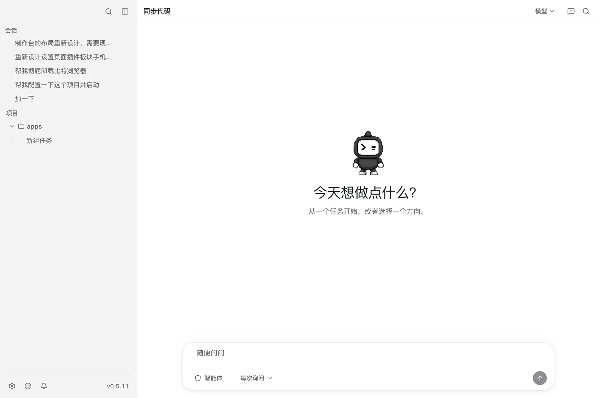
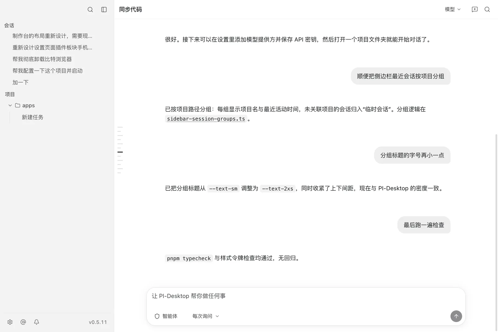
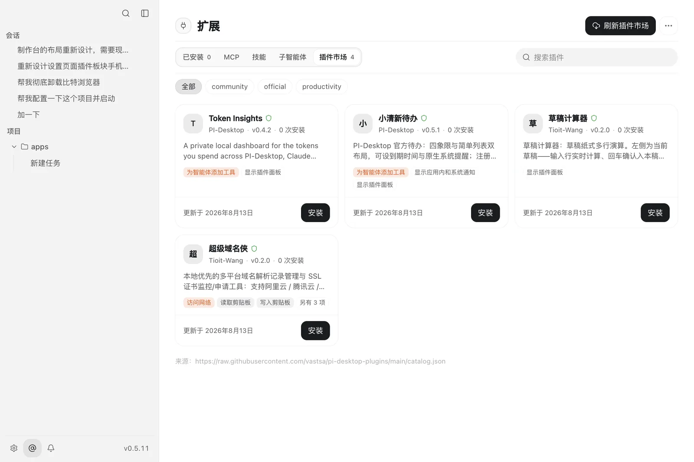
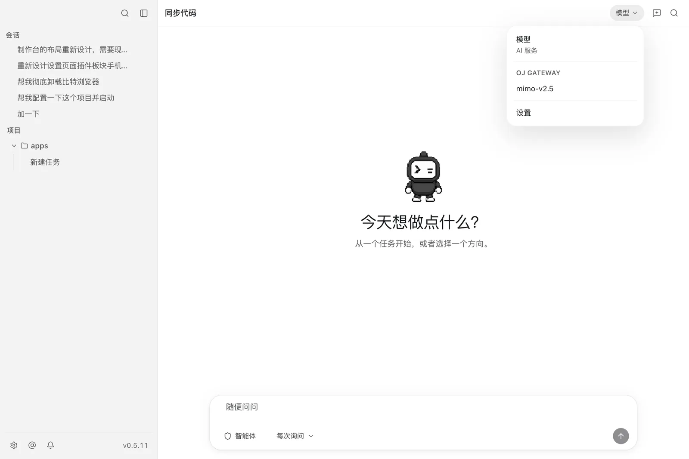
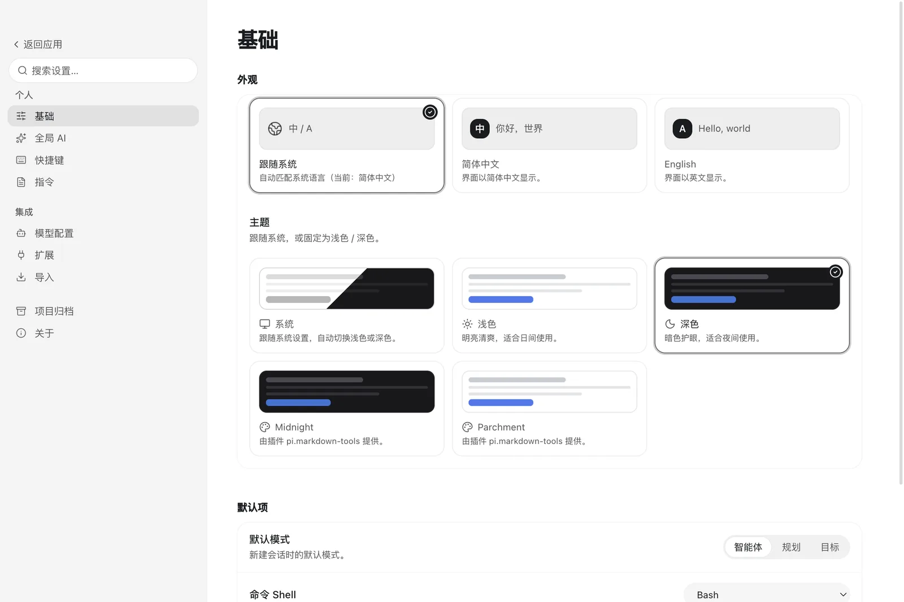

<div align="center">


# PI-Desktop

**本地优先的 AI 编程智能体桌面应用。**

自带模型，代码、密钥与会话全部留在你自己的电脑上。

[](https://github.com/vastsa/PI-Desktop/releases/latest)
[](https://github.com/vastsa/PI-Desktop/actions/workflows/ci.yml)


[下载](#下载) · [快速上手](#快速上手) · [功能亮点](#功能亮点) · [界面截图](docs/zh-CN/guide/screenshots.md) · [工作原理](#工作原理) · [参与开发](#参与开发) · [English](README.md)

<br/>



</div>

## PI-Desktop 是什么？

PI-Desktop 把 AI 编程智能体装进原生桌面应用：打开一个项目，说出你想做的事——探索并理解代码、构建新功能、审查代码、修复问题——然后看着它干活。每一次文件修改、每一条 shell 命令都会摆到你面前，由你批准。

不需要注册账号，没有订阅，中间也没有任何云服务：接上你已经在用的模型服务商即可，其余的一切——会话、设置、API 密钥——都保存在本地。

## 功能亮点

- **任意模型，自带密钥。** Anthropic、OpenAI，或任何兼容 OpenAI API 的服务——托管中转站可以，Ollama、LM Studio 这类本地网关也可以。模型 ID 自由填写（没有硬编码白名单），并支持按模型配置上下文窗口、输出上限、温度和思考模式。
- **智能体、规划与目标三种模式。** 智能体模式可以读写文件、执行命令，把事情做完；规划模式让同一个智能体检查项目并提交不可变实施检查点供你审批；目标模式让智能体先确认目标与验收标准，批准后自主推进直到完成或遇到边界。
- **每一次改动都由你批准。** 文件写入和 shell 命令先询问再执行，支持会话级授权和可配置的默认策略；超时未回应一律拒绝。
- **真正的工作台。** 在侧边工作面板中查看消息级 diff、谨慎回滚改动、打开终端、用浏览器预览、浏览项目文件——全程不用离开对话。
- **项目与会话。** 侧边栏按项目组织会话，支持多项目、置顶、归档、排序、分支、通知，还有用完即弃的临时会话。
- **本地优先，注重隐私。** 会话记录以 JSONL 纯文本存盘并配 SQLite 索引，随时备份、检索或删除；API 密钥存入系统钥匙串；日志只留在本地，没有任何遥测上报。
- **不止插件的扩展能力。** 在“扩展”页面管理独立 MCP 服务器、Skills 与 Subagents，并按全局或项目范围启用；插件可添加命令、面板、智能体工具、技能、主题、MCP、常驻服务和消息总线。`.piplug` 包、本地加载和官方插件市场目前都可用。
- **适合日常工作的快捷流程。** 支持斜杠命令、`@` 文件引用、将剪贴板文件保存到会话临时目录、回答流式输出时准备下一回合、Option/Alt+Space 全局搜索插件，以及手动或周期性任务提示。
- **用得舒服。** 简体中文与 English 双语界面，浅色/深色/跟随系统及插件主题，命令面板，新手引导清单，本地通知，上下文检查点，以及打包版本更新提示。

插件 API 和面板受权限控制并运行在独立进程中，但插件代码仍属于用户信任代码，并非完整的操作系统沙箱；请先检查权限，只安装可信插件。

<table>
  <tr>
    <td width="50%"></td>
    <td width="50%"></td>
  </tr>
  <tr>
    <td align="center"><sub>一条对话承载每一回合，长会话可用右侧缩略导航条定位</sub></td>
    <td align="center"><sub>从官方目录、镜像或你自己配置的地址安装插件</sub></td>
  </tr>
  <tr>
    <td width="50%"></td>
    <td width="50%"></td>
  </tr>
  <tr>
    <td align="center"><sub>按会话切换模型 — 任何已配置的提供方，密钥存在系统钥匙串里</sub></td>
    <td align="center"><sub>语言、主题与外观，包括插件贡献的主题</sub></td>
  </tr>
</table>

<p align="center"><sub><a href="docs/zh-CN/guide/screenshots.md">查看全部界面 →</a></sub></p>

## 下载

前往 [Releases 页面](https://github.com/vastsa/PI-Desktop/releases/latest)获取最新版本。

| 平台 | 安装包 | 状态 |
|---|---|---|
| macOS（Apple Silicon） | `.dmg` | ✅ 随版本发布 |
| Windows（x64） | NSIS 安装程序 | ✅ 随版本发布，支持应用内更新 |
| Linux（x64） | `.AppImage` / `.deb` | ✅ 随版本发布，AppImage 支持应用内更新 |

> **macOS 提示：** 当前构建尚未签名与公证。如果 macOS 拒绝打开应用，请右键点击应用选择**打开**，或清除隔离标记：
>
> ```bash
> xattr -cr /Applications/PI-Desktop.app
> ```

打包版本会检查 GitHub Releases 上的新版本，并在应用内显示更新横幅。

## 快速上手

1. **添加模型提供方。** 打开 **设置 → 模型配置 → 添加服务**：选择 API 风格，填入接口地址和 API 密钥，再选择或输入模型 ID。密钥会存入系统钥匙串，保存后不再显示。
2. **打开项目。** 在侧边栏添加项目文件夹——会话、工具与权限都以项目为边界。
3. **描述任务。** 想直接实施就用智能体模式；希望先检查项目并审批实施方案时切换到规划模式；想审批目标和验收标准再让智能体自主决策时使用目标模式。批准后的工作可在**审阅**面板里核对 diff，再决定是否提交。
4. **按需扩展。** 打开“扩展”管理 MCP、Skills、Subagents 或插件；在 **设置 → 导入** 中导入 Claude Code、OpenCode、Codex 或 Pi 的本机会话。

## 工作原理

PI-Desktop 保持渲染进程权限最小化，并把智能体循环与桌面 UI 分开：

- **Electron 外壳** — 沙箱化的 React 渲染进程，以及负责面板、终端、浏览器预览、更新和进程监管等桌面服务的主进程 / preload 桥。
- **Rust 宿主核心** — 通过 stdio JSON-RPC 独占管理 SQLite、会话存储、密钥、权限与工作区访问。
- **pi 智能体 sidecar** — 独立 Node 进程，运行 pi 引擎（`pi-ai` + `pi-agent-core`），承载真正的智能体循环。

完整设计见[架构规格](docs/spec/02-architecture/01-architecture.md)。

## 状态与路线图

PI-Desktop 处于活跃开发中的早期预览阶段。当前 0.5.x 已交付：应用外壳、流式智能体运行时、智能体/规划/目标合约、带权限系统的工作区工具、工作台、项目与会话、会话导入、扩展（插件/MCP/Skills/Subagents）、上下文检查点、通知，以及带更新检查的跨平台打包。

仍在推进：macOS 签名与公证、Windows/Linux 原生资格验证、更强的插件沙箱与发布者签名机制，以及完整的 UI 驱动 E2E 覆盖。详见[里程碑](docs/spec/06-delivery/01-mvp-milestones.md)与[项目看板](docs/project/BOARD.md)。

## 参与开发

环境要求：Node.js `>=22.19`、pnpm `>=10`（仓库使用 pnpm 11），以及 stable Rust 工具链。

```bash
# 构建 Rust 宿主核心
cargo build -p host-core

# 安装 JS 依赖并构建 packages + 应用
pnpm install
pnpm build:js

# 开发模式
pnpm dev

# 协议级 e2e 冒烟测试
PI_DESKTOP_TEST_API_KEY=... pnpm test:e2e

# 规划模式宿主验收（包含真实的 60 秒默认超时）
PI_DESKTOP_E2E_LONG_TIMEOUT=1 pnpm test:e2e:plan

# 通过 Electron CDP 验收英文与简体中文规划界面
pnpm test:e2e:plan-ui

# 桌面专项探针
pnpm test:e2e:boot
pnpm test:e2e:supervision
pnpm test:e2e:subagents
```

CI 会在每个 PR 上运行 JS 构建 / 类型检查 / lint / 单元测试及 `cargo test`。发布通过打 tag 完成：

```bash
node scripts/release.mjs 0.2.0 --tag   # 升版本 + 提交 + 打 v0.2.0 标签
git push origin main v0.2.0            # Release 工作流自动构建并发布
```

### 文档

- [插件开发：从零到一](docs/plugin-development.md)
- [界面截图](docs/zh-CN/guide/screenshots.md) — 每个界面，全部取自运行中的应用
- [规格索引](docs/spec/README.md) — 从这里开始
- [产品范围](docs/spec/01-product/01-product-scope.md)
- [基线决策](docs/spec/00-baseline.md)
- [架构](docs/spec/02-architecture/01-architecture.md)
- [UI 信息架构](docs/spec/04-ux/01-ui-ia.md)
- [E2E 测试计划](docs/spec/06-delivery/04-e2e-test-plan.md)
- [插件系统](docs/spec/07-plugins/01-plugin-system.md)
- [ADR](docs/adr/) · [里程碑](docs/spec/06-delivery/01-mvp-milestones.md) · [智能体指南](AGENTS.md)

## 开源项目致谢

PI-Desktop 的构建和设计参考了以下开源项目：

- **智能体运行时：** [pi-mono](https://github.com/badlogic/pi-mono)。其中的
  `pi-ai` 和 `pi-agent-core` 提供了智能体循环与模型供应商抽象。
- **桌面与界面基础：** [Electron](https://github.com/electron/electron)、
  [React](https://github.com/facebook/react)、
  [Vite](https://github.com/vitejs/vite)、
  [Tailwind CSS](https://github.com/tailwindlabs/tailwindcss)、
  [Lucide](https://github.com/lucide-icons/lucide)、
  [xterm.js](https://github.com/xtermjs/xterm.js)、
  [Shiki](https://github.com/shikijs/shiki)、
  [Mermaid](https://github.com/mermaid-js/mermaid)、
  [KaTeX](https://github.com/KaTeX/KaTeX)、
  [TypeBox](https://github.com/sinclairzx81/typebox) 和
  [i18next](https://github.com/i18next/i18next)。
- **行为与视觉参考：** [OpenAI Codex](https://github.com/openai/codex) 为
  部分外壳和上下文管理交互提供参考。[OpenCode DCP](https://github.com/Opencode-DCP/opencode-dynamic-context-pruning)
  曾作为上下文压缩的行为参考；它不是 PI-Desktop 的依赖，项目也没有复制
  其中的代码。
- **随应用打包的字体：** [Geist](https://github.com/vercel/geist-font)、
  [Inter](https://github.com/rsms/inter)、
  [Noto Sans SC](https://github.com/google/fonts)（Source Han Sans 系列）和
  [LXGW WenKai](https://github.com/lxgw/LxgwWenKai)，后者包含
  [Klee](https://github.com/fontworks-fonts/Klee) 项目的工作。它们的 SIL
  Open Font License 文本位于
  [`apps/desktop/src/assets/fonts/licenses/`](apps/desktop/src/assets/fonts/licenses/)。

## 社区友链

- [Linux.Do](https://linux.do/) — 技术交流与分享社区。

## 许可证

待定 — 将在首个正式版本发布前确定。
